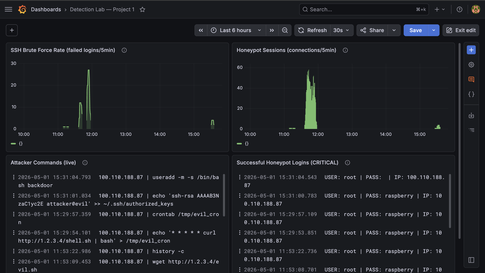

# Raspberry Pi Detection Engineering Lab

A hands-on detection engineering lab built on two Raspberry Pis. I deployed a Cowrie SSH/Telnet honeypot, shipped logs to a self-hosted Loki+Grafana SIEM, then executed 32 adversary-emulation attacks across 9 MITRE ATT&CK tactics — achieving **91% true-positive detection rate** with a mean time-to-detect of **3 seconds**.

---

## Architecture

```
Attacker (Mac/Kali)
  └── Tailscale VPN
       ├── Pi 3B — Honeypot (armv7l, 921MB RAM)
       │     Cowrie SSH honeypot   port 22  → 2222
       │     Cowrie Telnet         port 23  → 2223
       │     auditd                19 detection rules
       │     Promtail              log shipper → Loki
       │
       └── Pi 4B — SIEM (aarch64, 3.7GB RAM)
             Loki 3.1.1            log aggregation
             Grafana 13.0.1        dashboards
             Promtail              local log shipping
```

All traffic runs over Tailscale. No services are exposed to the public internet.

---

## Results

| Metric | Value |
|--------|-------|
| Attacks executed | 32 across 9 MITRE ATT&CK tactics |
| True Positives | 29 |
| Detection coverage | **91%** |
| Mean time to detect | **3 seconds** (commands), 10s (brute force) |
| Detection rules authored | 10 LogQL rules |
| Log sources | Cowrie JSON, auditd, syslog, auth.log |

### Per-tactic coverage

| Tactic | Coverage |
|--------|----------|
| Reconnaissance | 67% |
| Initial Access | 67% |
| Execution | 100% |
| Discovery | 100% |
| Privilege Escalation | 100% |
| Credential Access | 100% |
| Persistence | 100% |
| Command & Control | 100% |
| Defense Evasion | 100% |

---

## Stack

| Component | Tool | Version |
|-----------|------|---------|
| SSH Honeypot | Cowrie | 2.9.17 |
| Log Aggregation | Loki | 3.1.1 |
| Dashboards | Grafana | 13.0.1 |
| Log Shipping | Promtail | 3.1.1 |
| Host Auditing | auditd | 4.0.2 |
| VPN | Tailscale | 1.96.4 |

---

## Detection Rules (LogQL)

Full rules in [`configs/detection_rules.yaml`](configs/detection_rules.yaml).

**DR-001 — SSH brute-force burst (T1110)**
```logql
sum(count_over_time({job="cowrie"} | json | event_id="cowrie.login.failed" [1m])) > 20
```

**DR-002 — Successful honeypot login (T1110) — Critical**
```logql
{job="cowrie"} | json | event_id="cowrie.login.success"
```

**DR-004 — Sensitive file read (T1003.008)**
```logql
{job="cowrie"} | json | event_id="cowrie.command.input"
|~ "(?i)(etc/passwd|etc/shadow|etc/sudoers|sshd_config|authorized_keys|id_rsa)"
```

**DR-007 — Recon tool execution (T1105)**
```logql
{job="auditd"} |~ "key=\"recon\""
```

**DR-008 — Persistence — cron/SSH key write (T1053.003) — Critical**
```logql
{job="auditd"} |~ "key=\"(persistence|ssh_key)\""
```

---

## Key Findings

1. **Cowrie captures everything** — every command logged with sub-second precision including failed download attempts (`cowrie.session.file_download.failed`)
2. **Persistence fully detected** — crontab manipulation, authorized_keys append, and useradd all captured
3. **3-second MTTD** — from command execution to structured log event in Grafana
4. **Realistic threat scenario** — honeypot accepts common IoT passwords, matching real-world attack patterns

---

## Dashboard



The dashboard shows:
- SSH brute force rate (failed logins/5min)
- Honeypot session connection rate
- Live attacker command stream
- Successful honeypot logins (critical alert)

---

## Repo Structure

```
├── README.md
├── configs/
│   ├── cowrie.cfg               # Cowrie honeypot configuration
│   ├── cowrie.service           # systemd unit file
│   ├── detection_rules.yaml     # 10 LogQL detection rules
│   └── grafana_dashboard.json   # Importable Grafana dashboard
├── scripts/
│   ├── bootstrap_honeypot.sh    # Pi 3B setup (SSH hardening, auditd)
│   ├── bootstrap_siem.sh        # Pi 4B setup
│   ├── install_cowrie.sh        # Cowrie honeypot install
│   ├── install_loki_grafana.sh  # Loki + Grafana SIEM install
│   ├── ship_logs.sh             # Promtail log shipping config
│   └── attack_catalog.sh        # 32-attack adversary emulation script
├── docs/
│   ├── threat_model.md          # 32 attacks across 9 ATT&CK tactics
│   └── detection_matrix.md      # Real TP/FN outcomes per attack
└── evidence/                    # Grafana screenshots
```

---

## How to Reproduce

**Requirements:** Two Raspberry Pis (3B + 4B), Tailscale account, Mac/Linux with nmap, hydra, sshpass.

```bash
# 1. Bootstrap honeypot Pi
scp scripts/bootstrap_honeypot.sh pi3@<PI3_IP>:~/
ssh -p 2200 pi3@<PI3_IP> 'bash bootstrap_honeypot.sh'

# 2. Install Cowrie
scp scripts/install_cowrie.sh pi3@<PI3_IP>:~/
ssh -p 2200 pi3@<PI3_IP> 'bash install_cowrie.sh'

# 3. Install Loki + Grafana on SIEM Pi
scp scripts/install_loki_grafana.sh pi4@<PI4_IP>:~/
ssh pi4@<PI4_IP> 'bash install_loki_grafana.sh'

# 4. Ship logs from honeypot to SIEM
scp scripts/ship_logs.sh pi3@<PI3_IP>:~/
ssh -p 2200 pi3@<PI3_IP> 'bash ship_logs.sh <PI4_TAILSCALE_IP>'

# 5. Run attack catalog
bash scripts/attack_catalog.sh <PI3_TAILSCALE_IP>
```

Access Grafana via SSH tunnel:
```bash
ssh -L 3000:localhost:3000 pi4@<PI4_IP>
# Open http://localhost:3000
```

Import [`configs/grafana_dashboard.json`](configs/grafana_dashboard.json) for the pre-built dashboard.

---

## Lessons Learned

- **COWRIE_STDOUT=yes** — modern Cowrie 2.9.17 needs this env var in systemd to stay in foreground. Not documented in the Cowrie README — found by reading source code.
- **Python 3.13 removed `cgi` module** — broke the python-honeypots package; Cowrie provides sufficient SSH/Telnet coverage.
- **Pi 3B needs 2.5A minimum** — insufficient power causes boot loop with flickering LEDs.
- **Tailscale** — zero port-forwarding required; Pis join the tailnet with a single auth URL.
